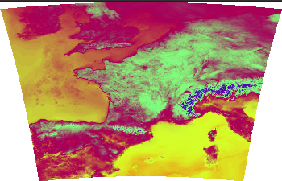

# IPM Decisions Weather Adapter for MeteoFrance
This software package builds a Docker image for a location based weather service that provides 40 hour weather forecasts from MeteoFrance with a 2.5km (TODO CHECK) resolution



Example temperature map (using ncview on the NetCDF file generated from the sources)

[Information about MeteoFrances's Public Data Service](https://donneespubliques.meteofrance.fr/?fond=produit&id_produit=131&id_rubrique=51)

Weather parameters returned
* Air temperature (&deg;C)
* Relative humidity (%)
* Rainfall (mm)
* Wind speed (m/s)

&copy; Copyright 2021 Met Norway and NIBIO

Authors: Frank Thomas Tveter (Met Norway) and Tor-Einar Skog (NIBIO)

## License
```
 Copyright (c) 2021 NIBIO <https://www.nibio.no/> and Met Norway <https://www.met.no/>
 
 This program is free software: you can redistribute it and/or modify
 it under the terms of the GNU Affero General Public License as published by
 the Free Software Foundation, either version 3 of the License, or
 (at your option) any later version.
 
 This program is distributed in the hope that it will be useful,
 but WITHOUT ANY WARRANTY; without even the implied warranty of
 MERCHANTABILITY or FITNESS FOR A PARTICULAR PURPOSE.  See the
 GNU Affero General Public License for more details.
 
 You should have received a copy of the GNU Affero General Public License
 along with this program.  If not, see <http://www.gnu.org/licenses/>.
 
```

## Specifications
The build will clone the master branch of [NetCDF-Location-Weather-Adapter](https://github.com/H2020-IPM-Decisions/NetCDF-Location-Weather-Adapter)

## Building and running
``` bash
sudo docker build --tag ipmdecisions/weather_adapter_meteofrance:ALPHA-01 .
sudo docker run --publish 5001:80 -dt ipmdecisions/weather_adapter_meteofrance:ALPHA-01
```
After you start the container, it will start downloading weather data from MeteoFrance. Expect 15-30 minutes (bandwidth dependent) before the service is up and running.

Example request: `http://localhost:5001/?latitude=50.109&longitude=10.961`

Example reply: 

``` json
{
    "interval": 3600,
    "locationWeatherData": [
        {
            "QC": [
                1,
                1,
                1,
                1
            ],
            "altitude": null,
            "data": [
                [
                    14.814233398437523,
                    0.0,
                    35.703216552734375,
                    3.8541791898506776
                ],
                [
                    15.175866699218773,
                    0.0,
                    33.47217559814453,
                    null
                ],
                [
                    15.206994628906273,
                    0.0,
                    33.76985168457031,
                    4.183494360105575
                ],
                [
                    15.335015869140648,
                    0.0,
                    36.68367004394531,
                    3.840319335295686
                ],
                [
                    14.854516601562523,
                    0.0,
                    33.751651763916016,
                    3.602969343755372
                ],
                [
                    14.103784179687523,
                    0.0,
                    37.24634552001953,
                    2.601287918950971
                ],
                [
                    12.394921875000023,
                    0.0,
                    45.625083923339844,
                    null
                ],
                [
                    10.504602050781273,
                    0.0,
                    51.273834228515625,
                    2.0517004078565253
                ],
                [
                    9.436425781250023,
                    0.0,
                    52.6353759765625,
                    3.051190572282602
                ],
                [
                    8.345178222656273,
                    0.0,
                    54.7446174621582,
                    2.899483957087403
                ],
                [
                    7.602746582031273,
                    0.0,
                    57.47803497314453,
                    2.251498147440603
                ],
                [
                    6.898034667968773,
                    0.0,
                    60.979095458984375,
                    1.687989269959213
                ],
                [
                    6.044702148437523,
                    0.0,
                    64.99285888671875,
                    1.4817510602421746
                ],
                [
                    5.234399414062523,
                    0.0,
                    69.04454040527344,
                    1.5360392198224508
                ],
                [
                    4.816003417968773,
                    0.0,
                    70.72201538085938,
                    1.5755621618309628
                ],
                [
                    4.406823730468773,
                    0.0,
                    72.46408081054688,
                    1.55810126074232
                ],
                [
                    4.034997558593773,
                    0.0,
                    74.47725677490234,
                    1.3688400744059261
                ],
                [
                    4.147149658203148,
                    0.0,
                    76.08087158203125,
                    1.1172881181129346
                ],
                [
                    5.996362304687523,
                    0.0,
                    70.03461456298828,
                    0.8735094658372032
                ],
                [
                    8.196374511718773,
                    0.0,
                    61.91530990600586,
                    0.5444043617782925
                ],
                [
                    10.388299560546898,
                    0.0,
                    60.63108825683594,
                    0.4176932166480504
                ],
                [
                    12.859033203125023,
                    0.0,
                    57.64539337158203,
                    0.42352229391933244
                ],
                [
                    15.168572998046898,
                    0.0,
                    49.8568115234375,
                    0.7304487990648403
                ],
                [
                    16.614251708984398,
                    0.0,
                    43.41646957397461,
                    1.269616931078029
                ],
                [
                    17.520074462890648,
                    0.0,
                    40.438995361328125,
                    1.502718766292288
                ],
                [
                    17.850274658203148,
                    0.0,
                    38.71072006225586,
                    1.6494658096715404
                ],
                [
                    18.114587402343773,
                    0.0,
                    37.07866668701172,
                    1.4915345046387067
                ],
                [
                    18.198968505859398,
                    null,
                    38.44697189331055,
                    1.1322541538026725
                ]
            ],
            "latitude": "50.109",
            "longitude": "10.961"
        }
    ],
    "timeEnd": "2021-04-28T15:00:00Z",
    "timeStart": "2021-04-27T12:00:00Z",
    "weatherParameters": [
        1001,
        2001,
        3001,
        4012
    ]
}
```
